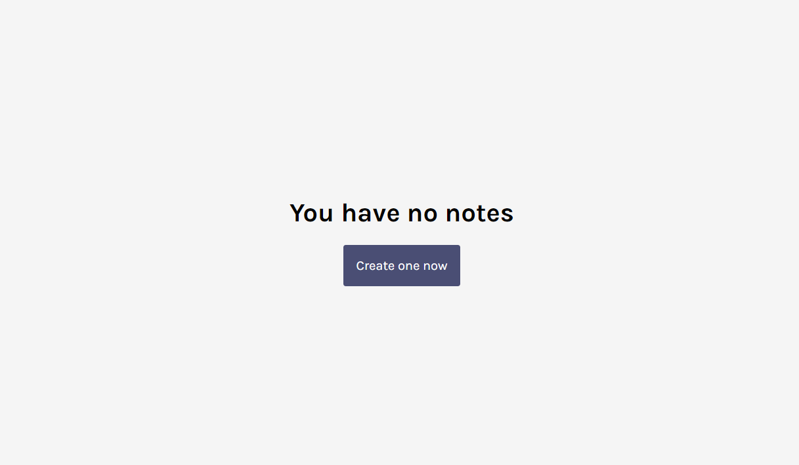
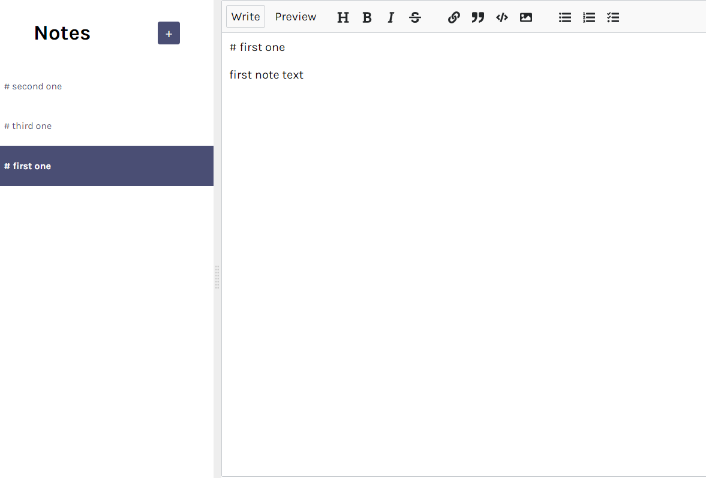
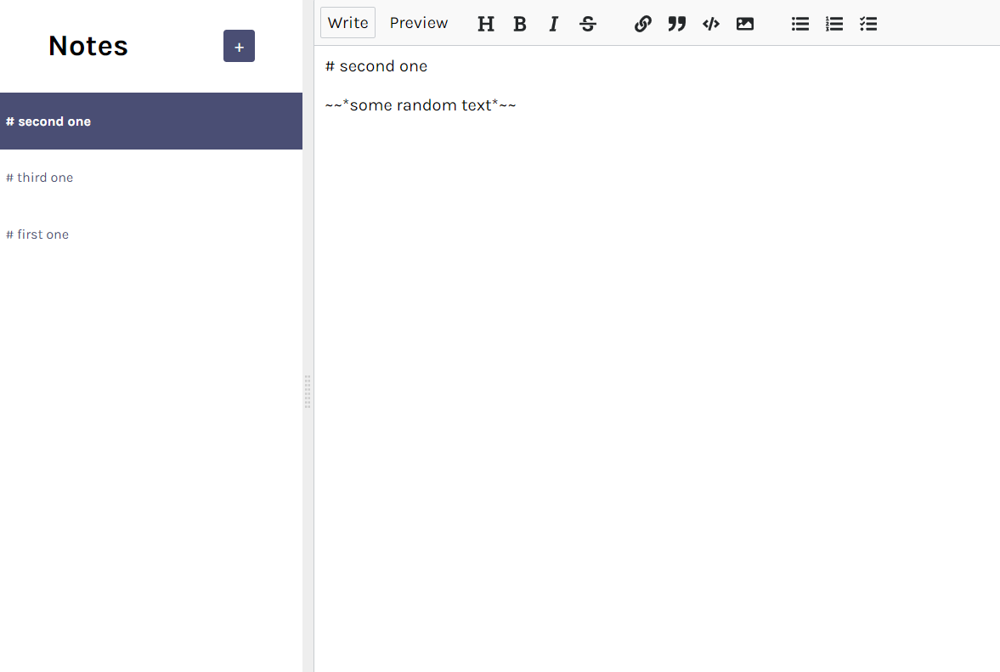
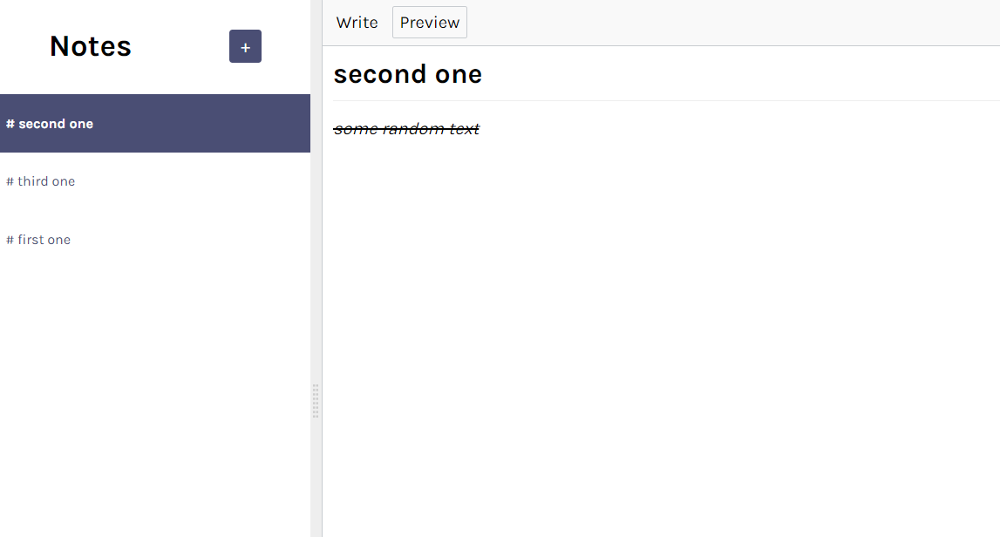

# Notes App

This is a simple notes app built with React, React MDE, and Cloud Firebase. It allows you to create, read, update, and delete notes using a user-friendly Markdown editor.

## Features

- Create new notes with a title and content.
- Edit existing notes using the Markdown editor.
- View notes in a clean and organized interface.
- Delete notes you no longer need.
- Automatically saves notes to the Cloud Firebase backend.

## Technologies Used

- React: A JavaScript library for building user interfaces.
- React MDE: A Markdown editor for React applications.
- Cloud Firebase: A backend-as-a-service platform for building web and mobile applications.

## Installation

1. Clone the repository:

   Copy

   ```
   git clone https://github.com/Dina170/notes-app-react.git
   ```

   ```

   ```

2. Navigate to the project directory:

   ```
   cd notes-app
   ```

3. Install the dependencies:

   ```
   npm install
   ```

4. Create a Firebase project and set up Cloud Firestore.
5. Replace the Firebase configuration in `src/firebase.js` with your own Firebase project configuration.
6. Start the development server:

   ```
   npm start
   ```

7. Open your web browser and visit `http://localhost:3000` to view the app.

## Usage

1. To create a new note, click on the "New Note" button and enter a title and content for the note.
2. To edit an existing note, click on the note in the sidebar. The note will open in the Markdown editor, where you can make changes.
3. To delete a note, click on the trash bin icon next to the note in the sidebar.

## Contributing

Contributions are welcome! If you have any suggestions, bug fixes, or new features to add, please open an issue or submit a pull request.

## Screen Shots









## Acknowledgements

- React MDE: https://github.com/andrerpena/react-mde
- Cloud Firebase: https://firebase.google.com/
